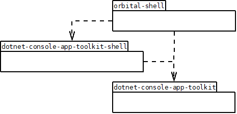

# Orbital Shell - Developer guide
**version 1.0 10/9/2020**  
*franck.gaspoz@gmail.com*

 This project is licensed under the terms of the MIT license: [LICENSE.md](LICENSE.md)

## Index
- [**Repositories, projects and namespaces**](#repos)

  - [dotnet-console-app-toolkit](#dotnet-console-app-toolkit)
  - [orbital-shell](#orbital-shell)
    - [DotNetCconsoleAppToolkit-Shell](#dotnet-console-app-toolkit-shell)
    - [OrbitalShell](#orbitalshell)
    - [OrbitalShell-Android](#orbital-shell-android)
    
- [**Set up a developement environment**](#setupdevenv)
- [**Software architecture**](#archi)
- [**Roadmap**](#roadmap)
</ol>
</b>

<a id="repos"/>

## 1. Repositories, projects and namespaces

<a id="dotnet-console-app-toolkit"/>

#### repository: dotnet-console-app-toolkit
#### project: DotNetConsoleAppToolkit

library that provides support for developing console applications (ANSI support)  
<b>C# 8 + .NET Standard 2.1</b>  
 
 [https://github.com/franck-gaspoz/dotnet-console-app-toolkit.git](https://github.com/franck-gaspoz/dotnet-console-app-toolkit.git) 

  

  
  

*namespaces*:  <b>DotNetConsoleAppToolkit</b>
<ul style="line-height:100%;margin:0px">
<li>    Console  
<li>    Component  
<ul style="line-height:100%;margin:0px">
<li>       UI  
</ul>
<li>   Lib  
</ul>

<a id="orbital-shell"/>

#### repository: orbital-shell  

 [https://github.com/franck-gaspoz/orbital-shell.git](https://github.com/franck-gaspoz/orbital-shell.git)

  

  
 

<a id="dotnet-console-app-toolkit-shell"/>

#### project: DotNetConsoleAppToolkit-Shell

**project url**: [https://github.com/franck-gaspoz/orbital-shell/DotNetConsoleAppToolkit-Shell](https://github.com/franck-gaspoz/orbital-shell/tree/master/DotNetConsoleAppToolkit-Shell) 

library extending DotNetConsoleAppToolkit that provides features for building a command shell  
<b>C# 8 + .NET Standard 2.1</b>  

*namespaces*: <b>DotNetConsoleAppToolkit</b>

<ul style="line-height:100%">
<li>    Component 
<ul style="line-height:100%;margin:0px">
<li>        CommandLine  
<ul style="line-height:100%;margin:0px">
<li>        CommandBatch
<li>        CommandLineReader  
<li>        CommandModel  
<li>        Data  
<li>        Defaults  
<li>        Parsing  
<li>        Pipeline  
<li>        Processor  
<li>        Variable 
</ul>
</ul>
<li>    Console  
<li>    Lib  
<ul style="line-height:100%;margin:0px">
<li>        Data  
<li>        FileSystem  
</ul>
<li>    Shell  
<ul style="line-height:100%;margin:0px">
<li>        Commands  
<ul style="line-height:100%;margin:0px">
<li>CommandLineProcessorCommands
<li>ConsoleCommands
<li>SystemCommands
<li>FileSystemCommands
<li>TextEditor
<li>TestCommands
</ul>
</ul>
</ul>

<a id="orbitalshell"/>

#### project: OrbitalShell

**project url**: [https://github.com/franck-gaspoz/orbital-shell/tree/master/OrbitalShell](https://github.com/franck-gaspoz/orbital-shell/tree/master/OrbitalShell)  
  
the orbital shell build for .NET Core targeting Windows,Linux and OSX  
<b>C# 8 + NET Core 3.1</b>  

*namespace*: <b>OrbitalShell  </b>

<a id="orbital-shell-android"/>

#### project: OrbitalShell-Android
**project url**: [https://github.com/franck-gaspoz/orbital-shell/tree/master/OrbitalShell-Android](https://github.com/franck-gaspoz/orbital-shell/tree/master/OrbitalShell-Android) 

the orbital shell build for Xamarin-Mono Android (APK)  
<b>C# 8 + <i>Mono ?</i></b>  
  
*namespace*: <b>OrbitalShell  </b>

<a id="setupdevenv"/>

## 2. Set up a development environment

<a id="archi"/>

## 3. Software architecture
### 3.1. Packages dependencies

  
   
<i>packages dependencies</i>

### 3.2. Flow diagram

*coming soon...*

<a id="roadmap"/>

## 4. Roadmap

- tests sur **OrbitalShell-Android**
- remanier et pousser projets dans GIT
- gestion code de retour, fixer comportement && et ||
- activation substitution des alias
- ligne de commande: activer flux et redirections
- ligne de commande: parser groupe de commandes et flux/redirections sur groupe
- variables du shell et paramètres de commandes (namespace réservé de *env*)
- commande **set**
- syntaxe d'affectation en subsitution de **set**
