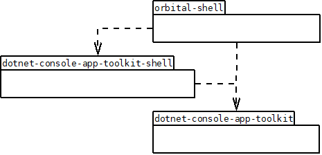

# Orbital Shell - Developer guide
**version 1.0 10/9/2020**  
*franck.gaspoz@gmail.com*

 This project is licensed under the terms of the MIT license: [LICENSE.md](LICENSE.md)

## Index
<b><ol style="line-height:100%">
<li>Repositories, projects and namespaces
<ul style="line-height:100%">
<li>dotnet-console-app-toolkit
<li>dotnet-console-app-toolkit-shell
<li>orbital-shell
<li>orbital-shell-android
</ul>
<li>Software architecture
<li>Setup a developement environment
<li>Roadmap
</ol>
</b>

## 1. Repositories, projects and namespaces

#### dotnet-console-app-toolkit (DotNetConsoleAppToolkit)

library that provides support for developing console applications (ANSI support)  
<b>C# 8 + .NET Standard 2.1</b>  
 
 [https://github.com/franck-gaspoz/dotnet-console-app-toolkit.git](https://github.com/franck-gaspoz/dotnet-console-app-toolkit.git) 

  

  
  

*namespaces*:  
<b>DotNetConsoleAppToolkit</b>
<ul style="line-height:100%;margin:0px">
<li>    Console  
<li>    Component  
<ul style="line-height:100%;margin:0px">
<li>       UI  
</ul>
<li>   Lib  
</ul>

#### dotnet-console-app-toolkit-shell (DotNetConsoleAppToolkit-Shell)

library that provides features of a command shell having the full ***bash*** (*Bourne Again shell*) features (POSIX)  
<b>C# 8 + .NET Standard 2.1</b>  
  

[https://github.com/franck-gaspoz/dotnet-console-app-toolkit-shell.git](https://github.com/franck-gaspoz/dotnet-console-app-toolkit-shell.git)
  
  

   
 

*namespaces*:   
<b>DotNetConsoleAppToolkit</b>
<ul style="line-height:100%">
<li>    Component 
<ul style="line-height:100%;margin:0px">
<li>        CommandLine  
<ul style="line-height:100%;margin:0px">
<li>        CommandBatch
<li>        CommandLineReader  
<li>        CommandModel  
<li>        Data  
<li>        Defaults  
<li>        Parsing  
<li>        Pipeline  
<li>        Processor  
<li>        Variable 
</ul>
</ul>
<li>    Console  
<li>    Lib  
<ul style="line-height:100%;margin:0px">
<li>        Data  
<li>        FileSystem  
</ul>
<li>    Shell  
<ul style="line-height:100%;margin:0px">
<li>        Commands  
<ul style="line-height:100%;margin:0px">
<li>CommandLineProcessorCommands
<li>CommandLineProcessorCommands
<li>ConsoleCommands
<li>SystemCommands
<li>FileSystemCommands
<li>TextEditor
<li>TestCommands
</ul>
</ul>
</ul>

#### orbital-shell (OrbitalShell)

the orbital shell build for .NET Core targeting Windows,Linux and OSX  
<b>C# 8 + NET Core 3.1</b>  
  
 [https://github.com/franck-gaspoz/dotnet-console-app-toolkit.git](https://github.com/franck-gaspoz/dotnet-console-app-toolkit.git)

  

  
 

*namespace*:  
<b>OrbitalShell  </b>

#### orbital-shell-android (OrbitalShell-Android)

the orbital shell build for Xamarin-Mono Android (APK)  
<b>C# 8 + <i>Mono ?</i></b>  
  
 [https://github.com/franck-gaspoz/dotnet-console-app-toolkit.git](https://github.com/franck-gaspoz/dotnet-console-app-toolkit.git)  

  

   
 

*namespace*:  
<b>OrbitalShell  </b>

## 2. Software architecture
### 2.1. Packages dependencies

  
   
<i>packages dependencies</i>

### 2.2. Synoptic

## 3. Roadmap

- tests sur **OrbitalShell-Android**
- remanier et pousser projets dans GIT
- gestion code de retour, fixer comportement && et ||
- activation substitution des alias
- ligne de commande: activer flux et redirections
- ligne de commande: parser groupe de commandes et flux/redirections sur groupe
- variables du shell et paramètres de commandes (namespace réservé de *env*)
- commande **set**
- syntaxe d'affectation en subsitution de **set**
