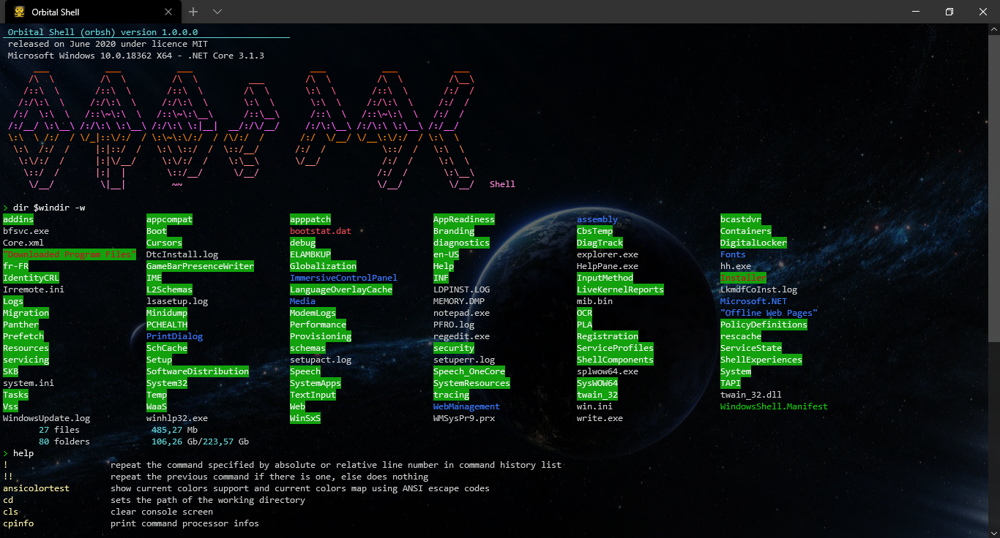

# Orbital Shell - ConsoleApp
<b>Orbital Shell ConsoleApp library</b> (previously "Dot Net Console App Toolkit") helps build fastly nice multi-plateform (windows, osx, arm) console applications using C# and .NET Core 3.1 and .NET Standard 2.1

[](license.md) This project is licensed under the terms of the MIT license: [LICENSE.md](LICENSE.md)  


# Index

- [Features](https://github.com/franck-gaspoz/dotnet-console-app-toolkit/blob/master/README.md#features)
- [Example: Orbital Shell (orbsh)](https://github.com/franck-gaspoz/dotnet-console-app-toolkit/blob/master/README.md#orbsh)
- [Packages dependencies](https://github.com/franck-gaspoz/dotnet-console-app-toolkit/blob/master/README.md#packages-dependencies)

# Features

The toolkit provides functionalities needed to build console applications running in a terminal (WSL/WSL2, cmd.exe, ConEmu, bash, ...) with text interface. That includes:
- <b>a text printer engine </b>that supports <b>print directives</b> allowing to manage console functionalities from text itself, as html would do but with a simplest grammar (that can be configured). That makes possible colored outputs, cursor control, text scrolling and also dynamic C# execution (scripting), based on several APIs like <b>System.Console</b> and <b> ANSI VT100 / VT52</b>. The print directives are available as commands strings, as a command from the integrated shell or from an underlying shell

    ``` csharp
    // -- example of a string containing print directives --
    
    // 1) from the toolkit shell command line:
    echo "(br,f=yellow,b=red)yellow text on red background(br)(f=cyan)current time is: (exec=System.DateTime.Now,br)"
    
    // 2) invoking the toolkit:
    orbsh.exe "(br,f=yellow,b=red)yellow text on red background(br)(f=cyan)current time is: (exec=System.DateTime.Now,br)"
    
    // 3) from C# using DotNetConsole.cs
    Echo($"{Br}{Yellow}{BRed}yellow text on red background{Br}{Cyan}current time is: {System.DateTime.Now}{Br}");
     ```
     <image src="Doc/Images/2020-06-13 06_18_08-Window.png"/>
    
- <b>UI controls</b> for displaying texts and graphical characters in a various way and handling user inputs

- <b>libraries of methods</b> for performing various print operations, data conversions, process management, ..

- <b>data types</b> related to the system and the environment that provides usefull methods

## Example : Orbital Shell (orbsh)



This is a view of what is done with the C# project <a href="https://github.com/franck-gaspoz/orbital-shell"><b>orbital-shell</b></a>. The **Dot Net Console App Toolkit Shell component** integrates anything needed to run a complete shell, write shell commands using C# and use console UI components.

> ### :information_source: &nbsp;&nbsp;&nbsp;&nbsp;How this example is coded ?
> This shell example runs with just a few lines of code:

``` csharp
    var commandLineProcessor = new CommandLineProcessor(args);
    var commandLineReader = new CommandLineReader(commandLineProcessor);
    var returnCode = commandLineReader.ReadCommandLine();
    Environment.Exit(returnCode);
```

## Packages dependencies:

Microsoft.CodeAnalysis.CSharp.Scripting 3.7.0-1.final
