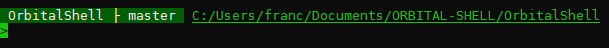
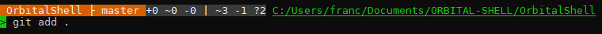
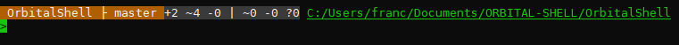
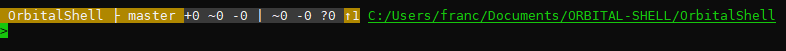
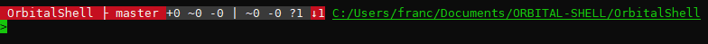
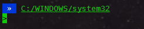

# Prompt Git Info
**module Orbital Shell**

Add custom text to the prompt of console showing the status of git repositories if the current directory is above a repository folder:

### Preview

up to date

worktree changed

index changed

ahead

behind

no repo

 
 

### Settings

namespace **env.com.git.promptInfo**

variable | type | value
-- | -- | --
aheadBackgroundColor               | string          | \e[48;5;136m
aheadTextTemplate                  | string          | %bgColor%(f=white) %repoName% ├ %branch% %sepSymbol%%errorMessage%\e[48;5;237m+%indexAdded% ~%indexChanges% -%indexDeleted% \| ~%worktreeChanges% -%worktreeDeleted% ?%untracked% \e[48;5;136m↑%ahead%(rdc)
behindBackgroundColor              | string          | (b=darkred)
behindTextTemplate                 | string          | %bgColor%(f=white) %repoName% ├ %branch% %sepSymbol%%errorMessage%\e[48;5;237m+%indexAdded% ~%indexChanges% -%indexDeleted% \| ~%worktreeChanges% -%worktreeDeleted% ?%untracked% (b=darkred)↓%behind%(rdc)
infoBackgroundColor                | string          | \e[48;5;237m
isEnabled                          | bool            | true
modifiedBackgroundColor            | string          | \e[48;5;130m
modifiedTextTemplate               | string          | %bgColor%(f=white) %repoName% ├ %branch% %sepSymbol%%errorMessage%\e[48;5;237m+%indexAdded% ~%indexChanges% -%indexDeleted% \| ~%worktreeChanges% -%worktreeDeleted% ?%untracked%(rdc)
modifiedUntrackedBackgroundColor   | string          | \e[48;5;166m
noDataTextTemplate                 | string          | %bgColor%(f=white) %repoName% ├ %branch% %errorMessage%(rdc)
templateNoRepository               | string          | (b=darkblue)(f=white) » %errorMessage%(rdc)
unknownBackgroundColor             | string          | (b=darkblue)
upToDateBackgroundColor            | string          | \e[48;5;22m

<b>Orbital Shell</b> is a multi-plateform (**windows, linux, macos**) command shell, inspired by <b><i>bash</i></b> and POSIX recommendations. It provides any usual bash shell feature (even if modernized) and nice syntaxes and features allowing to access (get/set/call) C# objects. Developed using **C# 8, .NET Core 3.1/Net 5 and .NET Standard 2.1**

