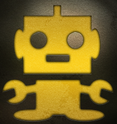
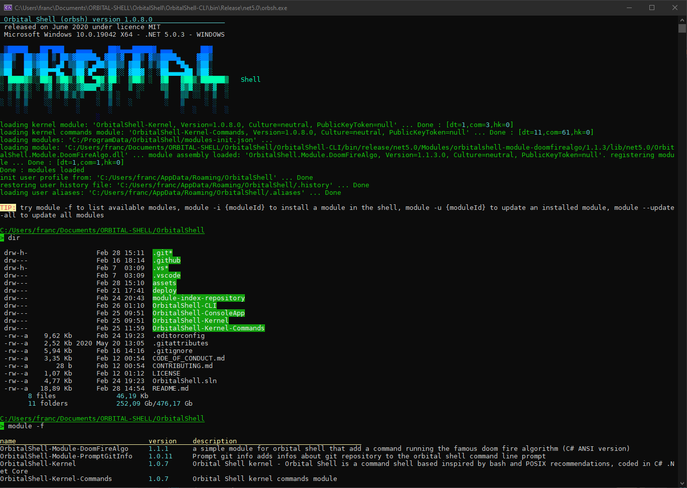

## Orbital Shell

<b>Orbital Shell</b> is a multi-platform (**windows, linux, macos, arm**) command shell (according to .Net Core supported platforms and APIs compatibilities), inspired by <b><i>bash</i></b> and **POSIX** recommendations.<br><br>It provides any usual bash shell feature (even if modernized) and 'user friendly' syntaxes allowing to access (get/set/call) C# objects.<br><br>Developed using **C# 8 .NET 5.0 - compatible with modules and libraries targeting .NET Core 3.1 and .NET Standard 2.1**

<br><br>


 
 
<br>


<br>


<br>


<br>
[](license)

**NuGet packages**<br>

<table border="0" >

<!-- libraries -->

<tr>
 <th>package ID</th>
 <th>type</th>
 <th>NuGet verion ID</th>
</tr>

<tr>
 <th colspan="3" align="left">libraries</th>
</tr>

<tr>
<td valign="top">
<a href="https://github.com/OrbitalShell/Orbital-Shell/tree/master/OrbitalShell-ConsoleApp" target="_new">OrbitalShell-ConsoleApp</a><br>
<a href="https://github.com/OrbitalShell/Orbital-Shell/tree/master/OrbitalShell-Kernel" target="_new">OrbitalShell-Kernel</a><br>
<a href="https://github.com/OrbitalShell/Orbital-Shell/tree/master/OrbitalShell-Kernel-Commands" target="_new">OrbitalShell-Kernel-Commands</a></td>
 
<td valign="top">
net5.0 classlib<br>
net5.0 classlib<br>
net5.0 classlib
</td>
 
<td valign="top">

[](https://www.nuget.org/packages/OrbitalShell-ConsoleApp) <br>
[](https://www.nuget.org/packages/OrbitalShell-Kernel) <br>
[](https://www.nuget.org/packages/OrbitalShell-Kernel-Commands) 
</td>

</tr>

<!-- modules -->

<tr>
 <th colspan="3" align="left">modules</th>
</tr>

<tr>
<td valign="top">
<a href="https://github.com/OrbitalShell/Prompt-Git-Info/blob/main/README.md" target="_new">OrbitalShell-PromptGitInfo</a><br>
<a href="https://github.com/OrbitalShell/Doom-Fire-Algo" target="_new">OrbitalShell-DoomFireAlgo</a><br>
 
<td valign="top">
shell module (net5.0)<br>
shell module (net5.0)
</td>
 
<td valign="top">

[](https://www.nuget.org/packages/OrbitalShell-Module-PromptGitInfo) <br>
[](https://www.nuget.org/packages/OrbitalShell-Module-DoomFireAlgo) 
</td>

</tr>

<!-- binaries -->

<tr>
 <th colspan="3" align="left">binaries</th>
</tr>

<tr>
<td valign="top">
<a href="https://www.nuget.org/packages/OrbitalShell/" targer="_new">OrbitalShell</a><br>
<a href="https://www.nuget.org/packages/OrbitalShell-win-x64/" targer="_new">OrbitalShell-win-x64</a><br>
<a href="https://www.nuget.org/packages/OrbitalShell-linux-musl-x64/" targer="_new">OrbitalShell-linux-musl-x64</a><br>
<a href="https://www.nuget.org/packages/OrbitalShell-linux-x64/" targer="_new">OrbitalShell-linux-x64</a><br>
<a href="https://www.nuget.org/packages/OrbitalShell-linux-arm/" targer="_new">OrbitalShell-linux-arm</a><br>
<a href="https://www.nuget.org/packages/OrbitalShell-linux-arm64/" targer="_new">OrbitalShell-linux-arm64</a><br>
<a href="https://www.nuget.org/packages/OrbitalShell-osx-x64/" targer="_new">OrbitalShell-osx-x64</a><br>
</td>
 
<td valign="top">
CLI any <b>dotnet</b> platform*<br>
CLI WIN x86<br>
CLI linux MUSL x64<br>
CLI linux x64<br>
CLI linux ARM<br>
CLI linux ARM x64<br>
CLI OSX x64<br>
</td>
 
<td valign="top">

[](https://www.nuget.org/packages/OrbitalShell) <br>
[](https://www.nuget.org/packages/OrbitalShell-win-x64) <br>
[](https://www.nuget.org/packages/OrbitalShell-linux-musl-x64) <br>
[](https://www.nuget.org/packages/OrbitalShell-linux-x64) <br>
[](https://www.nuget.org/packages/OrbitalShell-linux-arm) <br>
[](https://www.nuget.org/packages/OrbitalShell-linux-arm64) <br>
[](https://www.nuget.org/packages/OrbitalShell-osx-x64) <br>
</td>

</tr>

</table>

**Docker images**<br>

<table border="0" >

<tr>
 <th>image ID</th>
 <th>description</th>
 <th>link</th>
</tr>

<tr>
 
<td valign="top">
orbitalshell/orbital-shell
</td>

<td valign="top">
Linux Ubuntu amd64
</td>

<td valign="top">
https://hub.docker.com/r/orbitalshell/orbital-shell
</td>

</tr>

</table>

<br/>

## About the project

This shell integrates the <u>most usefull shell commands</u>, and is intented to be extended by coding new commands or downloading new commands modules within a repository of modules. Of course it can be entirely customized by using the features integrated to the shell (<u>scripts, functions, commands, aliases, settings, parametrization,...</u>). Having a strong <u>ANSI/VT-100-220-300-500</u> support, it provides structured and colorized display of data and information (support of <u>ASCII, Unicode and 24 bits colors</u>).

Find any information and documentation about this project on the project's Web Site @ [Orbital SHell Git-Pages](https://orbitalshell.github.io/OrbitalShell/) 

 &nbsp;&nbsp;&nbsp;&nbsp;&nbsp;&nbsp;&nbsp;&nbsp;&nbsp;&nbsp;&nbsp;&nbsp;&nbsp;&nbsp;&nbsp;&nbsp;&nbsp;&nbsp;&nbsp;&nbsp;&nbsp;

Developers and users manuals are available in the project web site @ [Orbital SHell Git-Pages (documentation)](https://orbitalshell.github.io/OrbitalShell/documentation) 


<br>

## Contribute !

😄 We are looking for **collaborators** 👯 to help for evolving this tool ! If you **like** the **command line**, the **bash** syntax, programming **cli tools**, **parsers**, **data streams**, ANSI, C# 8, batch, and so on... you may like to develop orbital shell! Any idea, suggest, code, feedback is welcomed ! You can directly **FORK** the project @ [https://github.com/OrbitalShell/Orbital-Shell.git](https://github.com/OrbitalShell/Orbital-Shell.git) and start developing to prepare your first pull request, it will be well received. You can also peek **an issue** and start working on. Join the **orbital shell team** and get advantages of the team tools on github. We can contact 💬 by mail, skype and so on...

You can directly **FORK** the project @ [https://github.com/OrbitalShell/Orbital-Shell.git](https://github.com/OrbitalShell/Orbital-Shell.git) and start developing to prepare your first pull request, it will be well received. You can also peek **an issue** and start working on. 

Join the **orbital shell team** and get advantages of the team tools on github. We can contact 💬 by mail, skype and so on...

  - read the [contribution guide lines](https://github.com/OrbitalShell/Orbital-Shell/blob/master/CONTRIBUTING.md) and the [code of conduct of the project](https://github.com/OrbitalShell/Orbital-Shell/blob/master/CODE_OF_CONDUCT.md)
  - read the project README @ [https://github.com/OrbitalShell/Orbital-Shell/blob/master/README.md](https://github.com/OrbitalShell/Orbital-Shell/blob/master/README.md)
  - visit the project's web site @ [https://orbitalshell.github.io/Orbital-Shell/](https://orbitalshell.github.io/OrbitalShell/)
  - visit the project repository @ [https://github.com/OrbitalShell/Orbital-Shell/](https://github.com/OrbitalShell/Orbital-Shell/)
  
**Join the project**: 

## :fast_forward: :fast_forward: Join the project. You can send a mail to the project team @ [mailto://orbital-shell@outlook.fr](mailto://orbital-shell@outlook.fr) or to the maintener [me](mailto://franck.gaspoz@gmail.com) 
- Curious / beginner / intermediate / expert are all welcomed!
- A simple **hello** from you part and you will be welcomed and invited to join the project 👍 !
- A simple **star** on the project main repo and you will also be invited 👋 !
## :fast_forward: :fast_forward: This project is a collaborative work, any one can participate and do anything he wishes 😎 !

There are a various subjects that can be treated:
- .NET 5.0 (C# 8) programming
- develop command line parser
- develop shell commands (find,ls,grep,sed,..: add/improve any command you want!)
- develop shell scripts (.orbsh/.sh)
- Technical documentation
- Automated Tests
- Code review / validation of pull requests
- Design any new feature
- CI/CD (powered by GitHub workflows)
- build binaries / distribs / .nupkg / setups / ...
- Web site development (design, content update, ...)
- Internationalization
- Translates
<br>

  **The project team like to meet people and wish to share pleasure of programming and technology enthusiasm, with fun and good spirit** 

<br><br>

## Features

*a view of the shell running in Windows Terminal*

<br>

- Is a '**bash** style' POSIX command shell <br> 
- The **modules** that are integrated into the shell provide **the most usefull shell commands** (ls/dir,rm,mv,cp,find,echo,clear,more,env,set,export,history,alias,...), tests commands, **text editor command**, and so on... , covering the fields of file system,text files,console output, data management, user input
  - modules can contains any item that the shell is intended to handle: commands, **hooks**, scripts/functions, settings, help, doc, assets, ... <br> 
  - dedicated repositories are used to get known modules list <br> 
  - modules are versioned and delivered throught **nupkg** packets, currently hosted at **NuGet** <br> 
  - modules are installed into the binaries of the shell <br>  
  - modules to be loaded are loaded by the shell kernel on user session startup <br>  
- _The shell command engine implements:_
  - A **command line reader** with:
    - usual input keyboard shortcuts <br>  
    - auto completion <br> 
    - input feedback (colorization) <br>  
  - **Streams** standard input (*stdIn*), standard output (*stdOut*), and standard error (*StdErr*) <br> 
  - **Streams redirections** ( **<** **>** ) <br> 
  - **pipelines** of commands:
    - sequences of commands ( **|** ) and conditional sequences of commands ( **&&**, **||** ) <br> 
    - groups of commands **(** .. **;** .. **)** <br> 
    - background execution ( **&** ) <br> 
    - commands return a **result code** and can returns **values** <br>  
      - When returning values and when specified, a pipe ( **|** ) between commands can **pass objects instead of streams** <br> 
  - **Cancellation** of commands execution **Task** (Ctrl-Z) <br>  
  - <u>**Batches of commands**</u> (scripts)
    - traditional batch of shell commands (.sh,.orbsh) <br> 
    - C# language scripts (.cssh) <br> 
  - <u>**Variables**</u>
    - Variables can store any data of **any C# object type**      
      - The command line syntax has been extended to **support an object notation to indicate accessing an object member or invoking an object method** <br>        
      - Integrates the os shell **environment variables** (with type **String**) <br> 
      - Are getted and setted with **$** (in any command arg), **set** and **=** <br> 
    - **Functions** can be defined by a **shell script** or by a **C# compiled source** <br> 
    - **Aliases** for command names <br>  
    - **Shell environment** : the shell initialization feature deploy and setup a shell environment for the current user (profile folder and initialization scripts: *.profile*,*.alias*,*.history*,*.orbsh*) <br>  
  - **Extensibility**:
    - The default command line grammar can be changed to get other syntaxes (***zsh***, ***DOS***,...) or a new one <br>  
    - The command line engine can be overriden and extended to enhance the existing features (auto complete inputs,parsing inputs,running commands,...) <br>  
    - **A simple way to define shell commands** using C# method and parameters attributes, avoiding the developer to handle syntax analyzing and shell integration (command help, pipelines, standard stream redirections) councerns, allowing to support either simple values types (int,float,string,date time,..) and object types (even generic collection), and that can interacts together and with the shell throught data objects <br>  

    ``` csharp
    // a Unix rm command implementation:
    [Command("remove file(s) and/or the directory(ies)")]
    public 
        CommandResult<(List<FileSystemPath> items, FindCounts counts)> 
        Rm(
            CommandEvaluationContext context,
            [Parameter("file or folder path")] WildcardFilePath path,
            [Option("r", "recurse", "also remove files and folders in sub directories")] bool recurse,
            [Option("i", "interactive", "prompt before any removal")] bool interactive,
            [Option("v", "verbose", "explain what is being done")] bool verbose,
            [Option("e", "delete-empty", "remove empty directories")] bool rmEmptyDirs,
            [Option("s", "short", "short display: do not print file system attributes when verbose")] bool noattributes,
            [Option("m", "simulate", "don't remove any file/or folder, just simulate the operation (enable verbose)")] bool simulate
        )
    {
        var r = new List<FileSystemPath>();
        var counts = new FindCounts();
        if (path.CheckExists(context))
        {
            var items = FindItems(context, path.FullName, path.WildCardFileName ?? "*", !recurse, true, false, !noattributes, !recurse, null, false, counts, false, false);
            
            /* ... */
            
            return new CommandResult<(List<FileSystemPath>, FindCounts)>((r, counts), ReturnCode.OK);
        }
        else
            return new CommandResult<(List<FileSystemPath>, FindCounts)>((r, counts), ReturnCode.Error);
    }
    ```

  - such a command will be auto documented like this by the shell **help command**:
  
    

<br>

## Orbital shell uses these libraries:

- Microsoft.CodeAnalysis.CSharp.Scripting
- Microsoft.Extensions.ObjectPool
- Microsoft.Extensions.Hosting
- NewtonSoft.Json

<br>

## notice / caveat

> The project orbital shell was dependent of the project **DotNetConsoleAppToolkit**. Now the library *DotNetConsoleAppToolkit* project repository is **ARCHIVED** since it has been integrated into the **orbital-shell** project repository as project **OrbitalShell-ConsoleApp**, so it is still under development but code has been moved to this repository


 | :warning: this project might be considered as a toy for old developer<br><br><br><br>
-- | --

*Warning: due to the average age of our main contributors, this project might contains **vintage** architecture,design and code. Nevertheless the source code is intensively based on young devs preferred patterns, C# 8 language usage (intellisense agrees), and it pretends to fit to good practices and architecture guidelines.*
